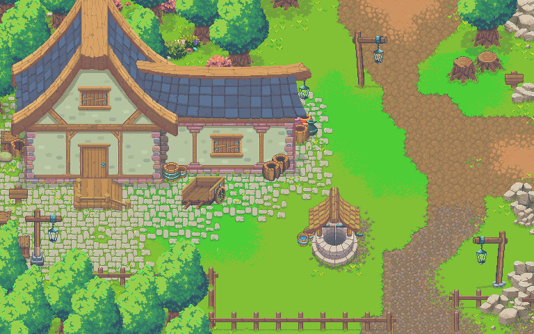
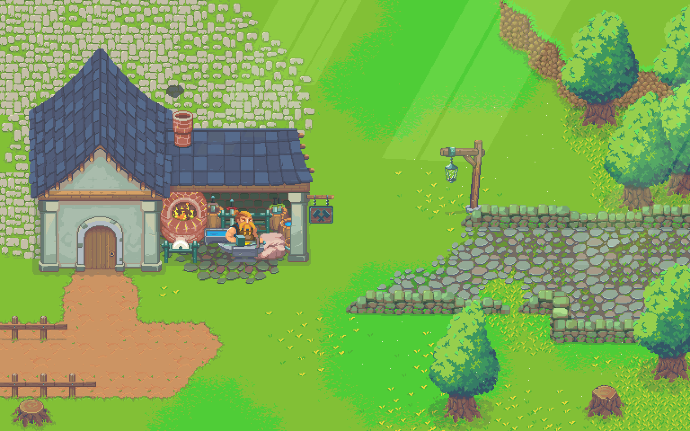
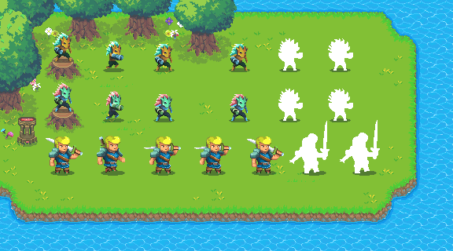
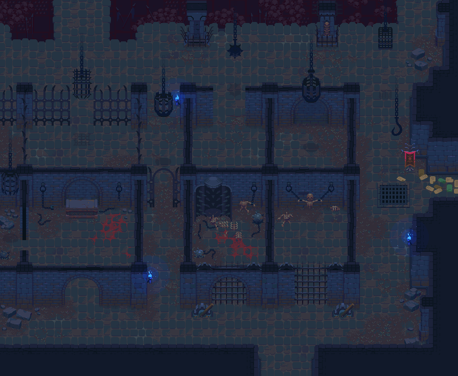
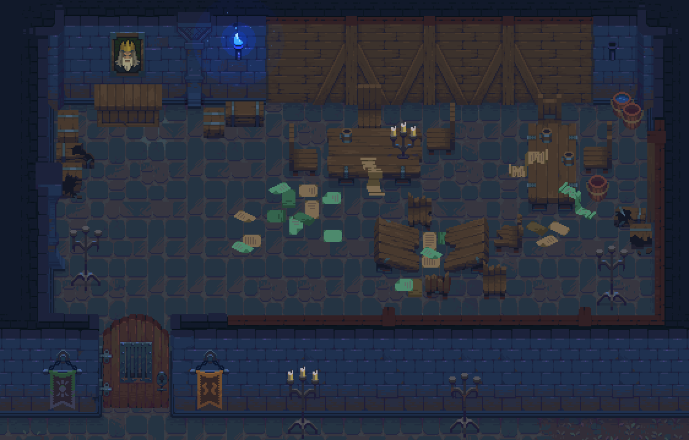
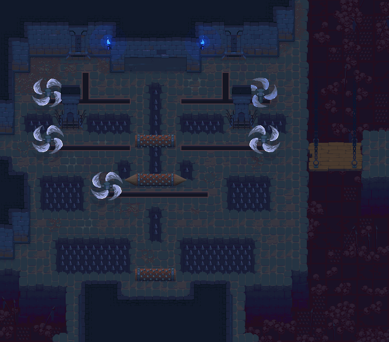
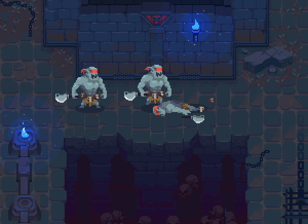

F2P GameFi《DarkMaze》商业计划书

# Demo地址
https://hxfjsw.github.io/DarkMarz/

# 概要
gamefi项目为名为为“DarkMaze”，旨在旨在全球范围的游戏爱好者一带来一种全新全新的游戏体验。我们的的核心核心目通过加密货币实现一个去中心化的虚拟世界，同时为用户提供更多可持续和有意义的游戏玩法。

# 游戏截图
## 主城

## 装备合成

## 人物背包

## 地下城（牢房）

## 地下城（房间）

## 地下城（机关）

## 地下城（怪物1）

# 市场分析
我们的产品是一款去中心化虚拟世界游戏，允许用户通过使用加密货币进行交易、购买虚拟物品以及参与社区活动。我们的游戏将提供各种游戏模式和活动，包括角色扮演游戏、策略游戏和多人在线竞技游戏等，以满足不同用户的需求。我们的经济模型将采用通证制度，让用户可以通过参与游戏活动获得收益，同时也可以使用通证购买虚拟物品和服务。

# 竞品分析
- 我们的主要竞争对手是Beacon，它是一家Gamefi公司，提供去中心化虚拟现实平台，使用户可以创建和体验虚拟世界。Beacon也使用通证作为经济模型，允许用户通过参与游戏活动获得收益，并使用通证购
- 竞品网址 http://thebeacon.gg

# 产品与服务

角色设定：玩家将扮演一个勇敢的冒险者，可以选择不同的职业，如战士、法师、盗贼等。每个职业都有自己的独特技能和特点。
故事设定：这个世界被恶魔和怪物所侵袭，玩家的目标是探索地牢和城市，找到并消灭这些恶魔和怪物，最终拯救这个世界。
关卡设计：游戏中有多个关卡，每个关卡都有自己的难度和挑战。玩家需要在每个关卡中探索地牢、战斗敌人、寻找宝藏和装备，最终到达关卡的终点。
规则设定：游戏采用回合制战斗，玩家和敌人交替行动。玩家需要管理角色的生命值、饥饿值和精神值，并通过吃食物、休息和使用魔法来维持角色的状态。同时，角色还需要管理自己的装备和道具，以应对不同的情况。
游戏设定：游戏中包含丰富的装备、道具和宝藏，玩家需要通过探索和战斗来获取。装备和道具可以帮助玩家在战斗中获得优势，宝藏可以帮助玩家升级和提高能力。
随机生成：游戏中的地牢和宝藏都是随机生成的，每次玩家进入关卡时都会有不同的挑战和机会。这也让游戏更具有挑战性和乐趣。

# 经济模型
1. 玩家需要先在市场中购买装备
2. 玩家进入地下城通关，开宝箱获取装备
3. 宝箱开出装备的好坏去解决于关卡难度和通关时间
4. 开出的装备可以去市场出售
5. 低级装备可以合成高级装备
6. 每周一次统计每个活跃用户的通关时间，做出天梯，作为赛季奖励发放的依据

# 用户画像
我们的目标用户是年龄在18至40岁之间的游戏玩家和加密货币爱好者，他们有以下特征：
- 对游戏有热情：他们是游戏的忠实粉丝，经常花费大量时间在游戏中，并对不同类型的游戏感兴趣。
- 熟悉加密货币：他们熟悉加密货币的概念和技术，了解其优势和风险，对使用加密货币进行交易感到舒适。
- 追求公平和透明：他们关注游戏内的经济模型是否公平和透明，希望获得更公正的收益分配方式。
- 寻求社区感和互动：他们喜欢参与社区活动和与其他玩家互动，认为这是游戏的重要组成部分。
- 对新技术和创新有兴趣：他们喜欢尝试新技术和创新的产品，认为这是游戏体验的一部分。
- 通过了解我们的目标用户，我们将可以设计更好的游戏体验和经济模型，并制定更有效的市场营销策略，从而吸引和留住我们的目标用户。

# 产品传播方式
- 社交媒体营销：我们将利用社交媒体平台（如Twitter、Facebook、Reddit和Discord）来推广我们的产品。我们将发布有关游戏的信息、教程、新功能和奖励的内容，同时定期与社区进行互动和回复用户的问题。
- 搜索引擎优化：我们将对我们的网站进行搜索引擎优化，以便在搜索结果中排名更高。我们将研究关键字和竞争对手，并通过增加网站内容和更新博客文章等方式来提高网站排名。
- 社区活动：我们将定期举办社区活动，例如举办游戏比赛、社区奖励计划和虚拟财产拍卖等。这些活动将吸引更多的用户加入我们的社区，并增强我们与现有用户之间的联系。
- 口碑营销：我们将鼓励用户分享他们的游戏经验和意见，并向他们提供奖励。这将有助于我们在社交媒体和其他在线平台上获得更多的曝光，并增加用户数量。
- 合作伙伴关系：我们将与其他游戏开发商、数字资产平台和加密货币交易所建立合作伙伴关系，以扩大我们的受众范围，并推广我们的产品。
- 付费广告：我们将通过付费广告在社交媒体、搜索引擎和其他在线平台上宣传我们的产品。我们将根据投资回报率来优化广告活动，以确保获得最佳效果。

# 盈利模式
- 游戏收入：我们的主要盈利来源将是游戏收入。我们将通过游戏内销售、广告和赞助等方式来获得收入。我们的游戏将设计为免费下载和试玩，但玩家需要购买虚拟货币或物品来获得更好的游戏体验。
- 数字资产销售：我们将为玩家提供各种数字资产，包括加密货币、游戏内道具和游戏收藏品等，以获取收入。我们将根据市场需求和供需关系来定价这些数字资产。
- 广告收入：我们将向合适的广告主推销广告位，以获取广告收入。我们将根据广告类型和点击率来定价广告位，并确保广告不会过于烦扰玩家的游戏体验。
- 授权收入：我们将通过授权我们的游戏角色、品牌和游戏内容来获取收入。我们将寻求与其他游戏公司、电影公司和其他品牌建立战略合作伙伴关系，以扩大我们的授权收入。
- 其他收入：我们还将寻求其他形式的收入来源，包括合作伙伴和赞助商的赞助、电子竞技比赛的赞助和票务收入等。

通过这些盈利模式，我们将努力实现收入的多元化和稳健性，从而为公司和投资者带来可观的回报。同时，我们将密切关注市场和玩家的反馈，不断优化我们的盈利模式和经济模型，以确保我们的收入和盈利能够持续增长。
# 我们对投资者的回报
## 我们将所有开发中产生的资产提供给投资者包括并不限于，基因这些材料投资者可以自行运营产品
- 游戏客户端源码
- 游戏服务端源码
- 官网源码
- 原始美术素材
- 原始音乐素材
- 素材商业使用版权
- NFT 智能合约（可升级）
- 市场前端源码
- 市场服务端源码